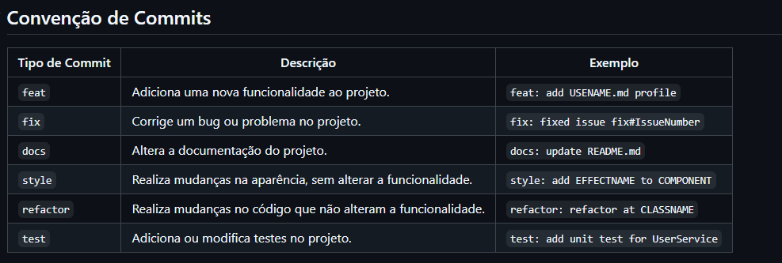

# Documentação Git: Principais Comandos

## Índice
- [O que é Git?](#o-que-é-git)
- [Configuração Inicial](#configuração-inicial)
- [Comandos Básicos](#comandos-básicos)
  - [git init](#git-init)
  - [git clone](#git-clone)
  - [git status](#git-status)
  - [git add](#git-add)
  - [git commit](#git-commit)
  - [git push](#git-push)
  - [git pull](#git-pull)
  - [git branch](#git-branch)
  - [git checkout](#git-checkout)
  - [git merge](#git-merge)
  - [git log](#git-log)
- [Outros Comandos Úteis](#outros-comandos-úteis)
  - [git stash](#git-stash)
  - [git remote](#git-remote)
  - [git rebase](#git-rebase)
  - [git gc](#git-gc)
---

## O que é Git?
O Git é um sistema de controle de versão distribuído usado para gerenciar e acompanhar mudanças no código-fonte ao longo do tempo. Ele facilita o trabalho em equipe, permitindo que múltiplas pessoas colaborem em projetos de maneira organizada e segura.

## Configuração Inicial

Antes de começar a usar o Git, você precisa configurá-lo com suas informações de usuário.

```bash
git config --global user.name "Seu Nome"
git config --global user.email "seuemail@exemplo.com"
```

## Comandos Básicos

### git init
Inicia um novo repositório Git no diretório atual.

```bash
git init
```

### git clone
Clona um repositório Git remoto para o seu computador.

```bash
git clone https://github.com/usuario/repo.git
```

Para clonar um repositório Git sem os commits anteriores (apenas trazendo os arquivos mais recentes, sem o histórico), você pode usar a opção `--depth` com o comando `git clone`. Isso cria um clone "raso" (shallow clone), que traz apenas o estado atual do repositório sem o histórico completo.

```bash
git clone --depth 1 https://github.com/usuario/repo.git
```

- `--depth 1`: Este parâmetro indica que você quer apenas o último commit do histórico (um clone raso).
- `1`: é o número de commits que você deseja clonar em seu repositorio considerando do commit mais recente ao mais antigo. 

- `https://github.com/usuario/repo.git`: O link do repositório que você deseja clonar.

Com isso, o Git irá baixar apenas os arquivos no estado atual, sem o histórico completo de commits, reduzindo o tamanho do clone e o tempo de download.

Caso deseja clonar o repositorio e trazer apenas pos ultimos 5 commits, basta utilizar:

```bash
git clone --depth 5 https://github.com/usuario/repo.git
```


### git status
Mostra o status dos arquivos no diretório de trabalho, informando quais foram modificados, adicionados ou estão aguardando commit.

```bash
git status
```

### git add
Adiciona arquivos modificados ou novos à área de preparação (staging), para que possam ser incluídos no próximo commit.

```bash
git add nome-do-arquivo
```

Ou para adicionar todos os arquivos modificados:

```bash
git add .
```

### git commit
Registra as mudanças no repositório local com uma mensagem descritiva.

```bash
git commit -m "Descrição das alterações"
```

### git push
Envia seus commits locais para o repositório remoto.

```bash
git push origin nome-da-branch
```

### git pull
Atualiza seu repositório local com as mudanças mais recentes do repositório remoto.

```bash
git pull
```

### git branch
Lista todas as branches existentes no repositório. Para criar uma nova branch, use `-b` seguido do nome da branch.

```bash
git branch
git branch -b nova-branch
```

### git checkout
Muda para outra branch ou revisões específicas.

```bash
git checkout nome-da-branch
```

### git merge
Combina mudanças de uma branch com outra. Esse comando deve ser executado a partir da branch que você desejar "mergear" com outra.

```bash
git merge nome-da-branch
```

### git log
Exibe o histórico de commits do repositório.

```bash
git log
```

## Outros Comandos Úteis

### git stash
Salva temporariamente as mudanças que não foram commitadas, permitindo que você limpe seu diretório de trabalho sem perder progresso.

```bash
git stash
```

Aqui está como você pode listar as stash e aplicar uma stash específica no Git:

#### **Listar todas as stash que você possui**
Para listar todas as stash armazenadas no repositório local, use o comando:

```bash
git stash list
```

Isso exibirá uma lista de todas as stash, com cada uma identificada por um índice (`stash@{n}`), onde `n` é o número da stash. Exemplo de saída:

```bash
stash@{0}: WIP on main: Commit message
stash@{1}: WIP on feature-branch: Commit message
stash@{2}: WIP on fix-branch: Commit message
```

#### **Aplicar uma stash específica**
Se quiser aplicar uma stash específica, você pode fazer isso utilizando o número dela na lista. Por exemplo, para aplicar a stash `stash@{1}`, use:

```bash
git stash apply stash@{1}
```

Se você quiser aplicar a stash mais recente (a primeira da lista), basta rodar o comando:

```bash
git stash apply
```

#### **Aplicar e remover a stash**
Se você quiser aplicar a stash e removê-la da lista ao mesmo tempo (ou seja, consumi-la), use o comando `git stash pop`:

```bash
git stash pop stash@{1}
```

Ou apenas:

```bash
git stash pop
```

Isso aplicará a stash mais recente e a removerá da lista de stash.

#### **Remover uma stash específica**
Se você quiser remover uma stash específica sem aplicá-la, use o comando `git stash drop`:

```bash
git stash drop stash@{1}
```

#### **Remover todas as stash**
Se você quiser limpar todas as stash de uma vez, use o comando:

```bash
git stash clear
```

### git remote
Mostra ou manipula repositórios remotos.

Para ver os repositórios remotos:

```bash
git remote -v
```

Para adicionar um novo repositório remoto:

```bash
git remote add origin https://github.com/usuario/repo.git
```

O comando `git remote` é usado para gerenciar os repositórios remotos de um projeto Git. Ele permite que você visualize, adicione, remova e gerencie conexões com repositórios hospedados em servidores remotos (como GitHub, GitLab, Bitbucket, etc.).

Aqui estão as principais coisas que você pode fazer com o comando `git remote`:

---

### **Listar repositórios remotos**

#### Comando:
```bash
git remote
```
Este comando lista todos os repositórios remotos associados ao seu repositório local. Ele exibe apenas os nomes dos repositórios.

#### Exemplo de saída:
```bash
origin
```

Para ver os URLs dos repositórios remotos, use a flag `-v` (verbose):

#### Comando:
```bash
git remote -v
```

#### Exemplo de saída:
```bash
origin  https://github.com/usuario/repo.git (fetch)
origin  https://github.com/usuario/repo.git (push)
```
Neste caso, o repositório remoto chamado `origin` está configurado tanto para "fetch" (baixar mudanças) quanto para "push" (enviar mudanças).

---

### **Adicionar um repositório remoto**

Se você quiser adicionar um novo repositório remoto, use o comando `git remote add`. 

#### Comando:
```bash
git remote add <nome-remoto> <url-remoto>
```

#### Exemplo:
```bash
git remote add origin https://github.com/usuario/novo-repo.git
```
Neste exemplo, estamos adicionando um repositório remoto chamado `origin` com a URL do GitHub.

Agora, você pode usar comandos como `git push origin main` para enviar seu trabalho para o repositório remoto que acabou de adicionar.

---

### **Renomear um repositório remoto**

Se você quiser renomear um repositório remoto, pode usar o comando `git remote rename`.

#### Comando:
```bash
git remote rename <nome-atual> <novo-nome>
```

#### Exemplo:
```bash
git remote rename origin upstream
```

Aqui, o repositório remoto chamado `origin` será renomeado para `upstream`.

---

### **Remover um repositório remoto**

Se você não quiser mais rastrear um repositório remoto, pode removê-lo com `git remote remove`.

#### Comando:
```bash
git remote remove <nome-remoto>
```

#### Exemplo:
```bash
git remote remove origin
```

Este comando remove a referência ao repositório remoto chamado `origin` do seu repositório local.

---

### **Alterar a URL de um repositório remoto**

Se a URL do repositório remoto mudou (por exemplo, você alterou o nome do repositório no GitHub ou mudou o protocolo de HTTP para SSH), você pode modificar a URL do repositório remoto usando `git remote set-url`.

#### Comando:
```bash
git remote set-url <nome-remoto> <nova-url>
```

#### Exemplo:
```bash
git remote set-url origin git@github.com:usuario/repo.git
```

Isso altera a URL do repositório `origin` para a nova URL SSH.

---

### **Exibir informações detalhadas sobre o repositório remoto**

Para ver informações detalhadas sobre um repositório remoto, incluindo as URLs de `fetch` e `push`, bem como o rastreamento de branches, você pode usar o comando `git remote show`.

#### Comando:
```bash
git remote show <nome-remoto>
```

#### Exemplo:
```bash
git remote show origin
```

#### Exemplo de saída:
```bash
* remote origin
  Fetch URL: https://github.com/usuario/repo.git
  Push URL: https://github.com/usuario/repo.git
  HEAD branch: main
  Remote branches:
    main                     tracked
  Local branch configured for 'git pull':
    main merges with remote main
  Local ref configured for 'git push':
    main pushes to main (up to date)
```

Isso mostra as informações sobre o repositório remoto `origin`, incluindo qual branch local está sincronizado com qual branch remota.

---

### **Verificar branches remotos**

O comando `git remote show` também permite verificar quais branches remotos estão disponíveis para sincronizar.

#### Comando:
```bash
git remote show <nome-remoto>
```

Isso exibe todas as branches disponíveis no repositório remoto, além de outras informações úteis.

---

#### Resumo dos principais comandos `git remote`:

- **Listar repositórios remotos:**
  ```bash
  git remote
  git remote -v
  ```

- **Adicionar um repositório remoto:**
  ```bash
  git remote add <nome-remoto> <url-remoto>
  ```

- **Renomear um repositório remoto:**
  ```bash
  git remote rename <nome-atual> <novo-nome>
  ```

- **Remover um repositório remoto:**
  ```bash
  git remote remove <nome-remoto>
  ```

- **Alterar a URL de um repositório remoto:**
  ```bash
  git remote set-url <nome-remoto> <nova-url>
  ```

- **Exibir detalhes de um repositório remoto:**
  ```bash
  git remote show <nome-remoto>
  ```

---


### git rebase
Reaplica seus commits em uma nova base, ajudando a manter o histórico linear.

```bash
git rebase nome-da-branch
```

### git gc

O comando `git gc` (abreviação de **garbage collection**) é usado para otimizar o repositório Git, limpando arquivos desnecessários e organizando o armazenamento de dados. Ele realiza a coleta de lixo do repositório, eliminando objetos que não são mais referenciados, compactando dados e, em geral, melhorando o desempenho do Git.

### Como o `git gc` funciona?

Quando você usa o Git, várias operações (como commits, branches, merges, etc.) geram dados internos, que são armazenados como objetos no diretório `.git`. Com o tempo, esses objetos podem se acumular, resultando em arquivos não referenciados, objetos duplicados ou fragmentados, e até objetos de backup antigos que já não são necessários.

O comando `git gc` é responsável por:

- **Compactação de objetos**: Ele compacta os objetos dispersos em pacotes maiores para reduzir o tamanho do repositório.
- **Remoção de objetos não referenciados**: Ele exclui objetos que não são mais referenciados por nenhum commit ou branch.
- **Limpeza de logs de referência (reflog)**: Remove entradas antigas do reflog que não são mais necessárias.
- **Reorganização do armazenamento**: Torna a estrutura de armazenamento do Git mais eficiente, melhorando o desempenho.

### Comandos básicos do `git gc`

#### **Rodar `git gc` com configurações padrão**

O comando mais simples é apenas rodar o `git gc` com as configurações padrão:

```bash
git gc
```

Isso fará a coleta de lixo e otimização sem opções adicionais, usando as configurações padrão do Git.

#### **Forçar o `git gc`**

Às vezes, o Git pode decidir que não é necessário rodar o `git gc` no momento, com base nas condições do repositório. Se você quiser forçar a execução da coleta de lixo, use a flag `--force`:

```bash
git gc --force
```

Isso forçará a execução da coleta de lixo, mesmo que o Git ache que não é necessário.

#### **Executar o `git gc` de maneira agressiva**

O `git gc` tem uma opção para rodar de maneira mais agressiva, compactando ainda mais os objetos e eliminando mais resíduos. O comando `--aggressive` é útil quando você deseja maximizar a otimização, embora possa demorar mais para ser concluído.

```bash
git gc --aggressive
```

Essa opção faz com que o Git gaste mais tempo compactando e reorganizando os objetos para um repositório menor e mais eficiente.

### Exemplo de uso prático

Imagine que seu repositório cresceu muito rapidamente ao longo de meses de desenvolvimento. Ele pode conter muitos objetos dispersos, arquivos que não são mais necessários, e até branches e tags deletadas que ainda deixam rastros no repositório. Executar `git gc` pode liberar espaço e melhorar a velocidade do Git, especialmente em grandes repositórios.

- **Verificar o tamanho do repositório antes do `git gc`**:
   Você pode usar o comando a seguir para ver o tamanho do seu repositório:
   ```bash
   git count-objects -vH
   ```

   Isso exibirá o tamanho dos objetos de dados e a quantidade de objetos soltos.

- **Rodar o `git gc`**:
   ```bash
   git gc --aggressive
   ```

- **Verificar o tamanho após a otimização**:
   Após o comando `git gc`, você pode rodar novamente o comando `git count-objects -vH` para ver a redução no tamanho do repositório.

### Outras opções úteis de `git gc`

- **`git gc --prune=<data>`**: Remove objetos que ficaram sem referência antes de uma data específica. O padrão é `2 semanas`, mas você pode especificar uma data ou número de dias.
  
  Exemplo para remover objetos que ficaram sem referência há mais de 30 dias:
  ```bash
  git gc --prune=30.days.ago
  ```

- **`git gc --auto`**: O Git executa a coleta de lixo automaticamente com base em certas condições (como o número de commits ou tamanho de objetos). Usar `git gc --auto` força essa verificação, mas não executa a coleta de lixo se o repositório estiver em boas condições.

  ```bash
  git gc --auto
  ```

### Quando usar o `git gc`?

- **Após um grande número de operações**: Se você fez muitas operações como criação de branches, merges e rebase, o `git gc` pode ajudar a manter o repositório em boas condições.
- **Quando o repositório está grande demais**: Se o seu repositório está consumindo muito espaço, `git gc --aggressive` pode compactar e liberar espaço.
- **Antes de fazer backup**: É uma boa prática rodar `git gc` antes de fazer um backup do repositório, pois ele irá compactar e otimizar os dados.

### Cuidados ao usar `git gc`

- **Demora**: Em repositórios grandes, especialmente com a opção `--aggressive`, a execução do `git gc` pode demorar muito tempo.
- **Objetos não referenciados**: O `git gc` pode remover objetos que não estão mais referenciados por commits ou branches. Se você está em um cenário em que pode querer restaurar objetos "perdidos" (como um commit que foi revertido), tenha cuidado com a execução da coleta de lixo.

---

# Convenção de Commits

A **convenção de commits** é uma maneira padronizada de escrever mensagens de commit para garantir que elas sejam claras, concisas e consistentes. Um dos padrões mais usados é o **Conventional Commits**, que segue um formato específico para facilitar a leitura e o entendimento do histórico de mudanças, além de permitir a geração automática de changelogs e versionamento semântico.

### Padrão do Conventional Commits

O formato básico de um commit seguindo o padrão **Conventional Commits** é o seguinte:

```
<tipo>[escopo opcional]: <descrição>

[corpo opcional]
[rodapé opcional]
```

#### 1. **Tipos de commits:**
- **feat**: Adição de um novo recurso ou funcionalidade.
- **fix**: Correção de bugs ou problemas.
- **docs**: Alterações na documentação (README, comentários, etc).
- **style**: Alterações de estilo que não afetam o comportamento do código (espaços, vírgulas, formatação).
- **refactor**: Mudanças no código que não corrigem um bug ou adicionam uma nova funcionalidade.
- **test**: Adição ou alteração de testes.
- **chore**: Tarefas de manutenção que não afetam a lógica do código (atualização de pacotes, configurações de build).
- **perf**: Alterações que melhoram o desempenho.
- **build**: Mudanças que afetam o sistema de build ou dependências externas.
- **ci**: Alterações nos arquivos de integração contínua (CI) e scripts.

#### 2. **Escopo (opcional)**:
O escopo é opcional e indica a parte específica do projeto que foi alterada. Ele é útil para ajudar a identificar rapidamente onde a mudança foi feita (ex: `api`, `ui`, `database`).

#### 3. **Descrição**:
A descrição é uma linha curta e clara que resume a mudança. Ela deve ser escrita no estilo de frase e na voz ativa, sem ponto final.

#### 4. **Corpo (opcional)**:
O corpo da mensagem pode ser usado para descrever mais detalhadamente as mudanças feitas, especialmente quando se trata de commits maiores.

#### 5. **Rodapé (opcional)**:
O rodapé pode ser usado para fazer referência a questões relacionadas (ex.: bugs resolvidos ou tarefas de um board) ou para informar sobre mudanças breaking (quebra de compatibilidade).

### Exemplos de commits usando Conventional Commits

#### 1. **Adição de funcionalidade (feat)**:
```bash
feat(api): adicionar endpoint de autenticação
```

#### 2. **Correção de bug (fix)**:
```bash
fix(ui): corrigir alinhamento do botão de envio no formulário
```

#### 3. **Melhoria de performance (perf)**:
```bash
perf(consulta): otimizar consulta de usuários no banco de dados
```

#### 4. **Atualização de documentação (docs)**:
```bash
docs(readme): atualizar instruções de instalação
```

#### 5. **Refatoração de código (refactor)**:
```bash
refactor(auth): simplificar lógica de verificação de tokens
```

#### 6. **Adição de testes (test)**:
```bash
test(service): adicionar testes para o serviço de usuários
```

#### 7. **Tarefa de manutenção (chore)**:
```bash
chore(deps): atualizar dependências para versões mais recentes
```

#### 8. **Commit com corpo (exemplo com corpo da mensagem)**:
```bash
feat(ui): implementar modal de confirmação de exclusão

Adicionar uma confirmação antes de excluir um item. Isso evita exclusões acidentais e melhora a experiência do usuário.
```

#### 9. **Commit com rodapé para fechar uma issue**:
```bash
fix(login): corrigir erro ao tentar logar sem senha

Corrige o erro que permitia que a aplicação quebrasse quando o usuário tentava logar sem informar a senha.

Closes #123
```

#### 10. **Commit que introduz uma quebra de compatibilidade (BREAKING CHANGE)**:
```bash
feat(api): remover o suporte ao método legacy de autenticação

BREAKING CHANGE: o método de autenticação antiga foi removido. Agora é necessário usar o OAuth2 para autenticação.
```

### Vantagens do uso do Conventional Commits:
1. **Consistência**: Manter o mesmo formato ajuda a equipe a entender melhor o histórico de commits.
2. **Automatização**: Facilita a geração automática de changelogs e versionamento semântico.
3. **Clareza**: Fica mais fácil identificar o tipo de mudança (correção, nova feature, etc.) apenas lendo a mensagem de commit.

Essa convenção torna o desenvolvimento mais organizado e facilita a manutenção do projeto a longo prazo.

